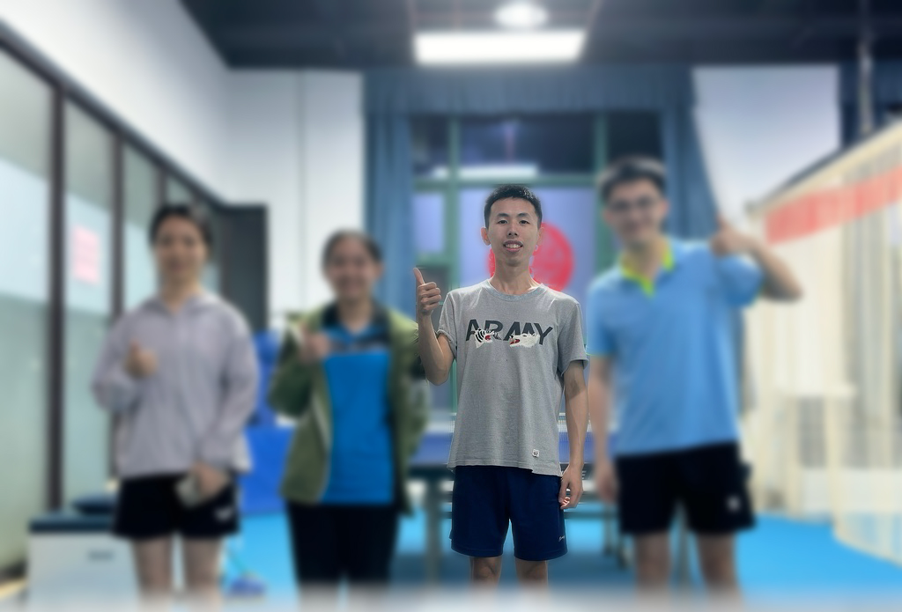

# Introduction
Hi! I'm CHEN XU, a student in the Framework-Based Software Design and Development course. 

## GitHub Profile

👨‍💻 About Me    
	🔹 Passionate about software engineering, especially in maintaining and improving existing systems.   
	🔹 Interested in framework-based development, design patterns, and clean code practices.   
	🔹 Always eager to explore new technologies and improve coding efficiency.   
 

🛠️ Tech Stack    
	• Languages:  Java, JavaScript，Jquery，JSP,HTML     
	• Frameworks: Spring Boot, Spring Cloud，     
	• Tools: Git, Gitee, Docker, VS Code     
	• Databases: MySQL     

📚 Learning Goals   
	✅ Gain hands-on experience with modern software maintenance techniques.   
	✅ Improve my ability to work with legacy systems efficiently.   
	✅ Master best practices for scalable and maintainable software framework design.   

